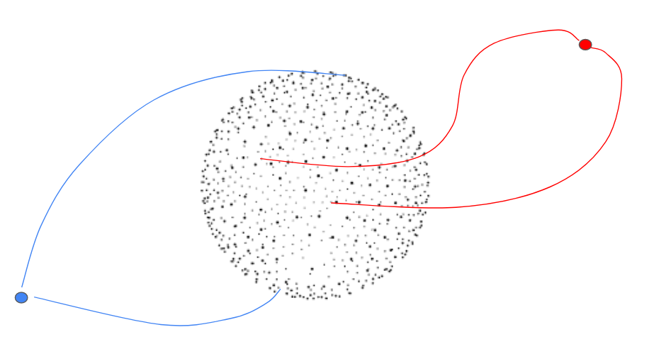

# Generalized Point Diffusion
The purpose of this derivation is to extend the ddpm diffusion equation to a more general form, where distributions converge to an arbitrary point in space (rather than just at the origin).

$$
\newcommand{\g}{\gamma}
\newcommand{\a}{\alpha}
\newcommand{\e}{\epsilon}
\newcommand{\ab}{\bar{\alpha}}
\newcommand{\x}{\mathbf{x}}
\newcommand{\sa}{\sqrt{\alpha}}
\newcommand{\sab}{\sqrt{\bar{\alpha}}}
\newcommand{\msab}{\sqrt{1-\bar{\alpha}}}
\newcommand{\msa}{\sqrt{1-\alpha}}
\newcommand{\I}{\mathbf{I}}
$$

## Goal of Derivation
We start with the goal of the following noising distribution:

$$q(\x_t|\x_0)=\mathcal{N}(\x_t; \sab_t \x_0 + (1-\sab_t)k_n, (1-\ab_t)\I)$$

Which the complimentary distribution:

$$q(\x_t|\x_{t-1})=\mathcal{N}(\x_t; \sa_t \x_{t-1} + \g_t k_n, (1-\alpha_t)\I)$$

Where we must determine what $\g_t$ is in this case. The relationship between $\a_t$ and $\ab_t$ is: $\ab_t = \prod_{s=1}^t \a_s$ 

First, we can use the reparameterization of a Gaussian in the following manner:
$$\begin{aligned}
    \x_1 &= \sa_1 \x_0 + \g_1 k_n +  \msa\e_1 \\
    \x_2 &= \sa_2 \x_1 + \g_2 k_n +  \msa\e_2 \\
    &= \sa_2 (\sa_1 \x_0 + \g_1 k_n +  \msa_1\e_1) + \g_2 k_n +  \msa_2\e_2 \\
    &= \sab_2 \x_0 + (\sa_2 \g_1 + \g_2) k_n + \msab_2 \e_1 \\
\end{aligned}$$

Thus, in general, we can that the mean of $q(\x_t|\x_0)$ is:

$$\mu_t(\x_t|\x_0) = \sab_t \x_0 + \sum_{s=1}^t \sab^{s+1}_t \g_s k_n$$

where we define (somewhat unintuitively) $\ab^{s+1}_t = \prod_{i=s+1}^t \a_i$, (which is equal to $1$ if $s+1=t$). We can also see that the covariance matrix is the same as normal: $\Sigma(\x_t|\x_0)=(1-\ab_t)\I$.

With this information in mind, we can now find a solution to $\g_t$.

$$\begin{aligned}
    \sab_t \x_0 + \sum_{s=1}^t \sab^{s+1}_t \g_s k_n &= \sab_t \x_0 + (1-\sab_t)k_n \\
    \sum_{s=1}^t \sab^{s+1}_t \g_s &= 1-\sab_t \\
    \g_t + \sum_{s=1}^{t-1} \sab^{s+1}_t \g_s &= 1-\sab_t \\
    \g_t &= 1-\sab_t - \sum_{s=1}^{t-1} \sab^{s+1}_t \g_s \\
    \g_t &= 1 - \sa_t
\end{aligned}$$

Which has a nice simplification.

## Deriving $q(\x_{t-1}|\x_t,\x_0)$
The main derivation for the generalized point ddpm is to find the distribution $q(\x_{t-1}|\x_t,\x_0)$. We begin with the following:

$$q(\x_{t-1}|\x_t,\x_0) = q(\x_t|\x_{t-1},\x_0) \frac{q(\x_{t-1}|\x_0)}{q(\x_t|\x_0)}$$

We already know what the covariance is for this distribution, the quantity of interest is the distribution. Thus, we can make simplifications keeping this in mind:

$$\begin{aligned}
    q(\x_{t-1}|\x_t,\x_0) &\propto \exp\left(-\frac{1}{2}\Omega(\x_t,\x_{t-1},\x_0)\right) \\
    \Omega(\x_t,\x_{t-1},\x_0) &= \frac{(\x_t-\sa_t\x_{t-1}-\gamma_t k_n)^2}{1-\a_t} + \frac{(\x_{t-1}-\sab_{t-1}\x_0-(1-\sab_{t-1})k_n)^2}{1-\ab_{t-1}} - \frac{(\x_t-\sab_t\x_0-(1-\sab_{t})k_n)^2}{1-\ab_t} \\
    &= \frac{f_1}{1-\a_t} + \frac{f_2}{1-\ab_{t-1}} - \frac{f_3}{1-\ab_t} \\
\end{aligned}$$

We can now (carefully) expand each of these terms and simplify. Remembering that we are only interested in the mean of this distribution, we can ignore any terms that do not depend on $\x_{t-1}$, meaning $f_3$

$$\begin{aligned}
    f_1 &:= \x_t^2 - 2\x_t\sa_t\x_{t-1} + \sa_t^2\x_{t-1}^2 - 2\x_t\g_t k_n + 2\sa_t\x_{t-1}\g_t k_n + \g_t^2 k_n^2 \\ 
    f_2 &:= \x_{t-1}^2 - 2\x_{t-1}\sab_{t-1}\x_0 + \sab_{t-1}^2\x_0^2 - 2\x_{t-1}(1-\sab_{t-1})k_n + 2\sab_{t-1}\x_0(1-\sab_{t-1})k_n + (1-\sab_{t-1})^2 k_n^2 \\
\end{aligned}$$

Next, these terms can be collected by $\x_{t-1}^2$ and $\x_{t-1}$, and then simplified:

$$\begin{aligned}
    \Omega(\x_t,\x_{t-1},\x_0) &= \left(\frac{\a_t}{1-\a_t} + \frac{1}{1-\ab_{t-1}} \right)\x_{t-1}^2 \\
    &- 2\left(\frac{\sa_t\x_t}{1-\a_t} + \frac{\sab_{t-1}\x_0}{1-\ab_{t-1}} - \frac{\sa_t\g_t k_n}{1-\a_t} - \frac{(1-\sab_{t-1})k_n}{1-\ab_{t-1}} \right)\x_{t-1} \\
    &=g_1\x_{t-1}^2 + 2g_2\x_{t-1} \\
\end{aligned}$$

Consider a simpler Gaussian: $\exp(-\frac{1}{2}(\x-\mu)^2)=\exp(-\frac{1}{2}(x^2-2x\mu+\mu^2))$. We can then find the mean of $q(\x_{t-1}|\x_t,\x_0)$ by looking at $\frac{g_2}{g_1}$. First, we simplify $g_1$:

$$\begin{aligned}
    g_1 &:= \frac{\a_t}{1-\a_t} + \frac{1}{1-\ab_{t-1}} \\
    &= \frac{\a_t(1-\ab_{t-1}) + 1-\a_t}{(1-\a_t)(1-\ab_{t-1})} \\
    &= \frac{1 - \ab_{t}}{(1-\a_t)(1-\ab_{t-1})} \\
\end{aligned}$$

and then $g_2$:

$$\begin{aligned}
    g_2 &:= \frac{\sa_t\x_t + \sa_t\g_t k_n}{1-\a_t} + \frac{\sab_{t-1}\x_0 - (1-\sab_{t-1})k_n}{1-\ab_{t-1}} \\
\end{aligned}$$

all in all, we can write the mean out to be:
$$\mu_{t-1} = \frac{g_2}{g_1} = \frac{(1-\a_t)(1-\ab_{t-1})}{1 - \ab_{t}}
\left( \frac{\sa_t\x_t + \sa_t\g_t k_n}{1 - \a_{t}} + \frac{\sab_{t-1}\x_0 - (1-\sab_{t-1})k_n}{1-\ab_{t-1}} \right)$$

This is the bare minimum to do diffusion to an arbitrary point in space! Happy out-of-distribution detecting... 

 
    

